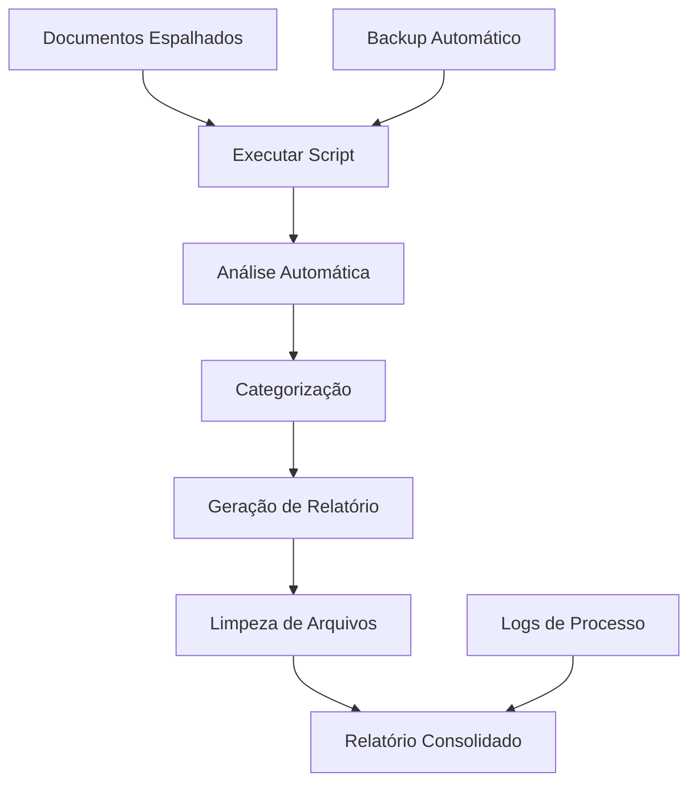

# 📋 Sistema de Consolidação Automática de Documentação

## 🎯 **Visão Geral**

Este sistema automatiza completamente o processo de análise, categorização e consolidação de documentação técnica, replicando o processo manual que realizamos hoje de forma padronizada e repetível.

## 🚀 **Funcionalidades**

### ✅ **Análise Automática**
- Escaneia recursivamente todos os arquivos de documentação
- Categoriza automaticamente por conteúdo e padrões de nome
- Extrai palavras-chave técnicas relevantes
- Gera resumos automáticos de cada arquivo
- Calcula métricas (tamanho, linhas, palavras)

### 📊 **Consolidação Inteligente**
- Agrupa arquivos por categoria de relevância
- Prioriza conteúdo por importância estratégica
- Gera relatório corporativo padronizado
- Inclui estatísticas e recomendações automáticas

### 🛡️ **Segurança e Backup**
- Cria backup automático antes de qualquer alteração
- Remove arquivos processados (opcional)
- Mantém logs detalhados de operações
- Suporte a rollback em caso de erro

## 📁 **Arquivos do Sistema**

| Arquivo | Descrição |
|---------|-----------|
| `Consolidate-Documentation.ps1` | Script principal de consolidação |
| `consolidation-config.ps1` | Configurações personalizáveis |
| `README-Consolidation.md` | Este arquivo de documentação |

## 🔧 **Instalação e Configuração**

### 1. **Pré-requisitos**
```powershell
# Verificar versão do PowerShell (requer 5.1+)
$PSVersionTable.PSVersion

# Habilitar execução de scripts (se necessário)
Set-ExecutionPolicy -ExecutionPolicy RemoteSigned -Scope CurrentUser
```

### 2. **Configuração Inicial**
```powershell
# Editar configurações (opcional)
notepad .\consolidation-config.ps1

# Verificar permissões do diretório
Test-Path -Path . -PathType Container
```

## 🚀 **Uso do Sistema**

### **Execução Básica**
```powershell
# Execução padrão (diretório atual)
.\Consolidate-Documentation.ps1
```

### **Execução com Parâmetros**
```powershell
# Especificar diretório personalizado
.\Consolidate-Documentation.ps1 -InputPath "C:\MeusProjetos\Docs"

# Manter arquivos originais (não deletar)
.\Consolidate-Documentation.ps1 -DeleteAnalyzedFiles:$false

# Desabilitar backup
.\Consolidate-Documentation.ps1 -CreateBackup:$false

# Nome personalizado para relatório
.\Consolidate-Documentation.ps1 -OutputFileName "RelatorioCustomizado.md"

# Exemplo completo
.\Consolidate-Documentation.ps1 `
    -InputPath "C:\Projetos\Documentacao" `
    -OutputFileName "Relatorio_$(Get-Date -Format 'yyyyMMdd').md" `
    -DeleteAnalyzedFiles:$false `
    -BackupPath ".\backups_documentacao"
```

### **Execução Agendada**
```powershell
# Criar tarefa agendada (executar semanalmente)
$Action = New-ScheduledTaskAction -Execute "PowerShell.exe" -Argument "-File C:\Scripts\Consolidate-Documentation.ps1"
$Trigger = New-ScheduledTaskTrigger -Weekly -DaysOfWeek Monday -At 9am
Register-ScheduledTask -TaskName "ConsolidacaoDocumentacao" -Action $Action -Trigger $Trigger
```

## ⚙️ **Configurações Avançadas**

### **Editar Categorias**
Edite o arquivo `consolidation-config.ps1` para personalizar:

```powershell
CategoryRules = @{
    "Minha Nova Categoria" = @{
        FilePatterns = @("*custom*", "*especial*")
        ContentKeywords = @("palavra-chave1", "palavra-chave2")
        Priority = 1
        Icon = "🔥"
    }
}
```

### **Adicionar Extensões de Arquivo**
```powershell
SupportedExtensions = @(
    ".md", ".txt", ".json",
    ".minhaextensao"  # Adicione aqui
)
```

### **Configurar Palavras-chave Técnicas**
```powershell
TechnicalKeywords = @(
    "MinhaTeconologia", "MeuFramework",
    # ... outras palavras-chave
)
```

## 📊 **Estrutura do Relatório Gerado**

O relatório consolidado inclui:

1. **📋 Sumário Executivo** - Visão geral e estatísticas
2. **📊 Distribuição por Categoria** - Organização temática
3. **🔍 Análise de Palavras-chave** - Tendências técnicas
4. **📁 Seções Detalhadas** - Por categoria de prioridade
5. **🎯 Recomendações Automáticas** - Próximos passos
6. **📈 Estatísticas Detalhadas** - Métricas completas

## 🔄 **Fluxo de Trabalho Típico**



## 📝 **Exemplos de Uso**

### **Cenário 1: Consolidação Mensal**
```powershell
# Criar pasta para o mês
$MesAtual = Get-Date -Format "yyyy-MM"
New-Item -Path ".\Consolidacoes\$MesAtual" -ItemType Directory -Force

# Executar consolidação
.\Consolidate-Documentation.ps1 `
    -OutputFileName "Relatorio_$MesAtual.md" `
    -BackupPath ".\Consolidacoes\$MesAtual\backup"
```

### **Cenário 2: Análise de Projeto Específico**
```powershell
# Analisar apenas documentação de um projeto
.\Consolidate-Documentation.ps1 `
    -InputPath "C:\Projetos\ProjetoX\docs" `
    -OutputFileName "Analise_ProjetoX.md" `
    -DeleteAnalyzedFiles:$false
```

### **Cenário 3: Integração com CI/CD**
```powershell
# Em pipeline de CI/CD
if (Test-Path ".\docs") {
    .\Consolidate-Documentation.ps1 `
        -InputPath ".\docs" `
        -OutputFileName "Documentation_Report.md" `
        -CreateBackup:$false
    
    # Upload do relatório para artefatos
    Write-Output "##vso[artifact.upload containerfolder=reports;artifactname=documentation]Documentation_Report.md"
}
```

## 🐛 **Troubleshooting**

### **Problemas Comuns**

#### ❌ **Erro de Execução de Script**
```powershell
# Solução: Habilitar execução
Set-ExecutionPolicy -ExecutionPolicy RemoteSigned -Scope CurrentUser
```

#### ❌ **Arquivo em Uso**
```powershell
# Verificar processos que usam arquivos
Get-Process | Where-Object {$_.ProcessName -like "*word*" -or $_.ProcessName -like "*excel*"}
```

#### ❌ **Permissões de Arquivo**
```powershell
# Verificar e corrigir permissões
$Path = "C:\MeuDiretorio"
$Acl = Get-Acl $Path
$Acl | Format-Table -AutoSize
```

#### ❌ **Codificação de Caracteres**
O script usa UTF-8 por padrão. Se houver problemas com acentos:
```powershell
# Converter arquivo para UTF-8
Get-Content "arquivo.txt" -Encoding Default | Set-Content "arquivo.txt" -Encoding UTF8
```

### **Logs de Debug**
```powershell
# Habilitar logs detalhados no config
LogSettings = @{
    EnableLogging = $true
    LogLevel = "Debug"
}

# Verificar logs
Get-Content .\consolidation.log -Tail 20
```

## 📈 **Métricas e Monitoramento**

### **KPIs Automaticamente Coletados**
- Número de arquivos processados
- Distribuição por categoria
- Frequência de palavras-chave técnicas
- Tamanho total de documentação processada
- Tempo de execução do processo

### **Dashboard de Acompanhamento**
O relatório inclui métricas que podem ser utilizadas para:
- Acompanhar evolução da documentação
- Identificar gaps de conhecimento
- Monitorar tendências tecnológicas
- Planejar treinamentos e capacitações

## 🔮 **Próximas Evoluções**

### **Versão 2.0 (Planejada)**
- [ ] Interface gráfica (GUI) com PowerShell ISE
- [ ] Integração com APIs de documentação (Confluence, SharePoint)
- [ ] Análise de sentimento em documentos
- [ ] Geração automática de diagramas de arquitetura
- [ ] Exportação para múltiplos formatos (PDF, HTML, Word)

### **Versão 3.0 (Conceitual)**
- [ ] Integração com IA para resumos mais inteligentes
- [ ] Análise semântica avançada
- [ ] Sugestões automáticas de melhorias
- [ ] Dashboard web em tempo real

## 🤝 **Contribuição e Feedback**

Para melhorar o sistema:

1. **Reporte Bugs**: Documente erros encontrados
2. **Sugira Melhorias**: Propose novas funcionalidades
3. **Compartilhe Configurações**: Contribua com novos padrões de categorização
4. **Teste Cenários**: Valide em diferentes tipos de projeto

## 📞 **Suporte**

### **Documentação Adicional**
- Configurações: `consolidation-config.ps1`
- Logs: `consolidation.log`
- Exemplos: Diretório `examples/` (se disponível)

### **Comandos Úteis para Debug**
```powershell
# Testar configuração
$Config = . .\consolidation-config.ps1
$Config.CategoryRules.Keys

# Verificar arquivos que seriam processados
Get-ChildItem -Recurse | Where-Object {$_.Extension -in @(".md", ".txt")} | Select-Object Name, Length

# Simular execução (dry-run)
# (Adicione parâmetro -WhatIf no futuro)
```

---

## 📄 **Licença e Disclaimer**

Este sistema foi desenvolvido para uso interno e educacional. Adapte conforme suas necessidades específicas.

**Versão**: 1.0  
**Data**: Novembro 2025  
**Compatibilidade**: PowerShell 5.1+, Windows 10/11  

---

**🎉 Com este sistema, você terá documentação sempre consolidada, organizada e atualizada automaticamente!**